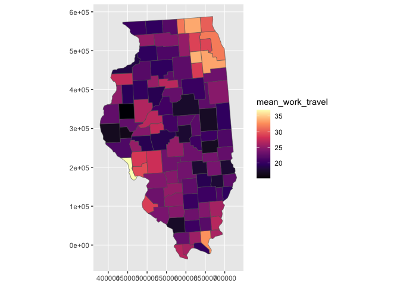
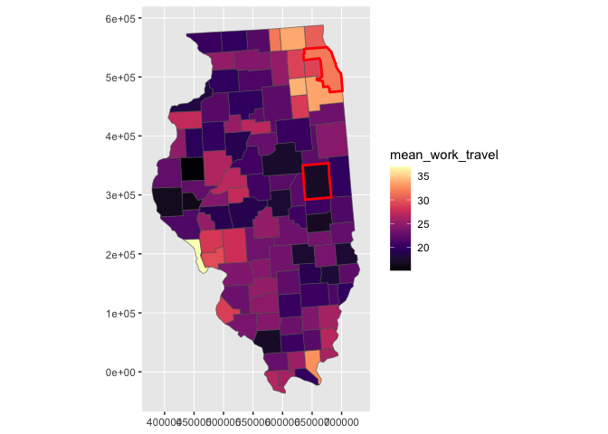
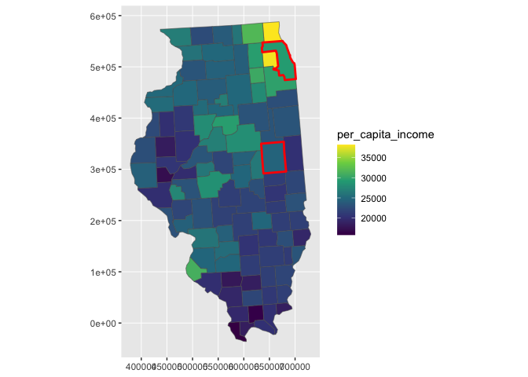
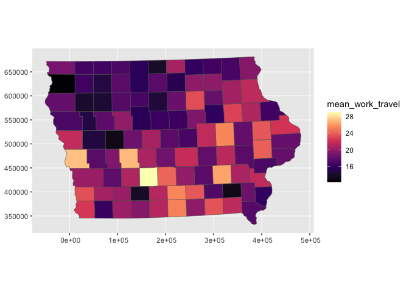

<!-- README.md is generated from README.Rmd. Please edit that file -->

# ggfips

``` r
library(tidyverse)
#> ── Attaching core tidyverse packages ──────────────────────── tidyverse 2.0.0 ──
#> ✔ dplyr     1.1.0     ✔ readr     2.1.4
#> ✔ forcats   1.0.0     ✔ stringr   1.5.0
#> ✔ ggplot2   3.4.1     ✔ tibble    3.2.0
#> ✔ lubridate 1.9.2     ✔ tidyr     1.3.0
#> ✔ purrr     1.0.1     
#> ── Conflicts ────────────────────────────────────────── tidyverse_conflicts() ──
#> ✖ dplyr::filter() masks stats::filter()
#> ✖ dplyr::lag()    masks stats::lag()
#> ℹ Use the conflicted package (<http://conflicted.r-lib.org/>) to force all conflicts to become errors
library(ggfips)


us_census %>% 
ggplot() +
  coord_sf() +
  aes(fips = fips) +
  aes(fill = mean_work_travel) +
  geom_sf_county() +
  scale_fill_viridis_c(option = "magma")
#> Joining with `by = join_by(fips)`
```


# spotlighting

``` r
us_census %>% 
ggplot() +
  coord_sf() +
  aes(fips = fips) +
  aes(fill = mean_work_travel) +
  geom_sf_county(state = "Illinois") +
  scale_fill_viridis_c(option = "magma")
#> Joining with `by = join_by(fips)`
```



``` r

last_plot() +
  geom_sf_county(state = "Illinois",
                 county = c("Cook", "Champaign"),
                 color = "red", linewidth = 1)
#> Joining with `by = join_by(fips)`
#> Joining with `by = join_by(fips)`
```



``` r

# aesthetic mapping quick change
last_plot() +
  aes(fill = per_capita_income) + 
  scale_fill_viridis_c()
#> Scale for fill is already present.
#> Adding another scale for fill, which will replace the existing scale.
#> Joining with `by = join_by(fips)`
#> Joining with `by = join_by(fips)`
```



``` r
us_census %>% 
ggplot() +
  coord_sf() +
  aes(fips = fips) +
  aes(fill = mean_work_travel) +
  geom_sf_county(state = "Texas") +
  scale_fill_viridis_c(option = "magma")
#> Joining with `by = join_by(fips)`
```


``` r


us_census %>% 
ggplot() +
  coord_sf() +
  aes(fips = fips) +
  aes(fill = mean_work_travel) +
  geom_sf_county(state = "Iowa") +
  scale_fill_viridis_c(option = "magma")
#> Joining with `by = join_by(fips)`
```



``` r

us_census %>% 
ggplot() +
  coord_sf() +
  aes(fips = fips) +
  aes(fill = mean_work_travel) +
  geom_sf_county(state = "New York") +
  scale_fill_viridis_c(option = "magma") +
  geom_sf_county(state = "New York",
                 county = c("Orange", 
                            "Putnam", 
                            "Westchester"), aes(color = name),
                 color = "red", linewidth = 1)
#> Joining with `by = join_by(fips)`
#> Joining with `by = join_by(fips)`
```


``` r

ggplot2::geom_sf_text
#> function (mapping = aes(), data = NULL, stat = "sf_coordinates", 
#>     position = "identity", ..., parse = FALSE, nudge_x = 0, nudge_y = 0, 
#>     check_overlap = FALSE, na.rm = FALSE, show.legend = NA, inherit.aes = TRUE, 
#>     fun.geometry = NULL) 
#> {
#>     if (!missing(nudge_x) || !missing(nudge_y)) {
#>         if (!missing(position)) {
#>             cli::cli_abort(c("both {.arg position} and {.arg nudge_x}/{.arg nudge_y} are supplied", 
#>                 i = "Only use one approach to alter the position"))
#>         }
#>         position <- position_nudge(nudge_x, nudge_y)
#>     }
#>     layer_sf(data = data, mapping = mapping, stat = stat, geom = GeomText, 
#>         position = position, show.legend = show.legend, inherit.aes = inherit.aes, 
#>         params = list2(parse = parse, check_overlap = check_overlap, 
#>             na.rm = na.rm, fun.geometry = fun.geometry, ...))
#> }
#> <bytecode: 0x7fde87b7ea48>
#> <environment: namespace:ggplot2>
```
