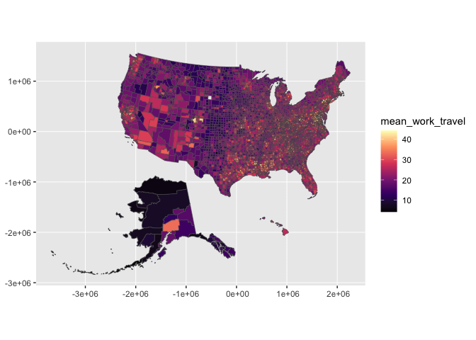

<!-- README.md is generated from README.Rmd. Please edit that file -->

# ggfips *is experimental* 🤩

… and most of the development work lives right here in the README.

<!-- badges: start -->

<!-- badges: end -->

The goal of ggfips is to provide an interface where you can quickly
build a map with a simple dataframe with fips codes and variables with
characteristics. geom\_sf\_fips brings the fips polygons (geometry
vector) that you’ll need to create maps based county and
characteristics.

It uses Claus Wilke’s fips geometries.

# The status quo

``` r
library(tidyverse)
#> ── Attaching core tidyverse packages ──────────────────────── tidyverse 2.0.0 ──
#> ✔ dplyr     1.1.0     ✔ readr     2.1.4
#> ✔ forcats   1.0.0     ✔ stringr   1.5.0
#> ✔ ggplot2   3.4.1     ✔ tibble    3.2.0
#> ✔ lubridate 1.9.2     ✔ tidyr     1.3.0
#> ✔ purrr     1.0.1     
#> ── Conflicts ────────────────────────────────────────── tidyverse_conflicts() ──
#> ✖ dplyr::filter() masks stats::filter()
#> ✖ dplyr::lag()    masks stats::lag()
#> ℹ Use the conflicted package (<http://conflicted.r-lib.org/>) to force all conflicts to become errors
library(sf)
#> Linking to GEOS 3.10.2, GDAL 3.4.2, PROJ 8.2.1; sf_use_s2() is TRUE
#> Linking to GEOS 3.8.1, GDAL 3.2.1, PROJ 7.2.1

fips_geometries <- readRDS(url("https://wilkelab.org/SDS375/datasets/US_counties.rds")) %>%
  rename(FIPS = GEOID) %>% 
  janitor::clean_names()

US_census <- read_csv("https://wilkelab.org/SDS375/datasets/US_census.csv",
                      col_types = cols(FIPS = "c")
          ) %>% 
  janitor::clean_names()

# from Claus Wilke on ggplot2
fips_geometries %>%
  left_join(US_census, by = "fips") %>%
  ggplot() +
  geom_sf(aes(fill = mean_work_travel, 
              fips = fips), # a bug or a feature?
          linewidth = .1) + 
  scale_fill_viridis_c(option = "magma") ->
classic_plot_sf_layer
#> Warning in layer_sf(geom = GeomSf, data = data, mapping = mapping, stat = stat,
#> : Ignoring unknown aesthetics: fips

classic_plot_sf_layer
```



``` r
layer_data(classic_plot_sf_layer) %>% 
  select(fips, geometry, xmin, xmax, ymin, ymax) ->
reference_fips

reference_fips %>% 
  left_join(fips_geometries) ->
reference_fips_full
#> Joining with `by = join_by(fips, geometry)`


save(reference_fips, file = "data/reference_fips.rda")
```

``` r
compute_county <- function(data, scales){
 
  data %>% 
    # inner_join(fips_ggplot2_reference, multiple = "all") 
    inner_join(reference_fips) %>% 
    mutate(group = -1)

}
```

# Step 2: pass to ggproto

``` r
StatCounty <- ggplot2::ggproto(`_class` = "StatCounty",
                                  `_inherit` = ggplot2::Stat,
                                  # required_aes = c("fips"), #breaks when required!?
                                  # setup_data = my_setup_data,
                                  compute_panel = compute_county,
                                  default_aes = aes(geometry = after_stat(geometry))
                                  )
```

# Step 3: write geom\_\* function

``` r
geom_sf_county <- function(
  mapping = NULL,
  data = NULL,
  position = "identity",
  na.rm = FALSE,
  show.legend = NA,
  inherit.aes = TRUE, ...) {
  ggplot2::layer(
    stat = StatCounty,  # proto object from step 2
    geom = ggplot2::GeomSf,  # inherit other behavior
    data = data,
    mapping = mapping,
    position = position,
    show.legend = show.legend,
    inherit.aes = inherit.aes,
    params = list(na.rm = na.rm, ...)
  )
}
```

# step 4: test geom\_\* function, celebrate\!

``` r
us_census <- read_csv("https://wilkelab.org/SDS375/datasets/US_census.csv",
                      col_types = cols(FIPS = "c")
          )  

head(us_census)
#> # A tibble: 6 × 53
#>   state   name  FIPS  pop2010 pop2000 age_u…¹ age_u…² age_o…³ female white black
#>   <chr>   <chr> <chr>   <dbl>   <dbl>   <dbl>   <dbl>   <dbl>  <dbl> <dbl> <dbl>
#> 1 Alabama Auta… 01001   54571   43671     6.6    26.8    12     51.3  78.5  17.7
#> 2 Alabama Bald… 01003  182265  140415     6.1    23      16.8   51.1  85.7   9.4
#> 3 Alabama Barb… 01005   27457   29038     6.2    21.9    14.2   46.9  48    46.9
#> 4 Alabama Bibb… 01007   22915   20826     6      22.7    12.7   46.3  75.8  22  
#> 5 Alabama Blou… 01009   57322   51024     6.3    24.6    14.7   50.5  92.6   1.3
#> 6 Alabama Bull… 01011   10914   11714     6.8    22.3    13.5   45.8  23    70.2
#> # … with 42 more variables: native <dbl>, asian <dbl>, pac_isl <dbl>,
#> #   two_plus_races <dbl>, hispanic <dbl>, white_not_hispanic <dbl>,
#> #   no_move_in_one_plus_year <dbl>, foreign_born <dbl>,
#> #   foreign_spoken_at_home <dbl>, hs_grad <dbl>, bachelors <dbl>,
#> #   veterans <dbl>, mean_work_travel <dbl>, housing_units <dbl>,
#> #   home_ownership <dbl>, housing_multi_unit <dbl>,
#> #   median_val_owner_occupied <dbl>, households <dbl>, …

stamp_sf_county_usa <- function(fill = "darkgrey"){
  
  
  geom_sf_county(data = reference_fips %>% 
                   select(fips), 
                 fill = fill, 
                 aes(fips = fips))
  
}

us_census %>% 
  ggplot() + 
  aes(fips = FIPS) +
  stamp_sf_county_usa() +
  geom_sf_county(linewidth = .02, 
                      color = "darkgrey") +
  aes(fill = mean_work_travel) + 
  coord_sf() +
  scale_fill_viridis_c(option = "magma")
#> Warning in geom_sf_county(data = reference_fips %>% select(fips), fill = fill,
#> : Ignoring unknown aesthetics: fips
#> Joining with `by = join_by(fips)`
#> Joining with `by = join_by(fips)`
```


-----

# Spotlighting

## can we make ggfips go further? Prototyping w/ Texas

``` r
stamp_sf_county_texas <- function(fill = "darkgrey"){
  
  
  geom_sf_county(data = fips_geometries %>% filter(name_2 == "Texas") %>% 
                   select(fips = fips), 
                 fill = fill, 
                 aes(fips = fips))
  
}

  
reference_fips_full %>% filter(name_2 == "Texas") %>% 
    select(fips, geometry, xmin,xmax, ymin, ymax) ->
reference_fips_texas

compute_county_texas <- function(data, scales){
 
  data %>% 
    inner_join(reference_fips_texas) %>% 
    mutate(group = -1)

}


StatCountytexas <- ggplot2::ggproto(`_class` = "StatCountytexas",
                                  `_inherit` = ggplot2::Stat,
                                  # required_aes = c("fips"), #breaks when required!?
                                  # setup_data = my_setup_data,
                                  compute_panel = compute_county_texas,
                                  default_aes = aes(geometry = after_stat(geometry))
                                  )


geom_sf_county_texas <- function(
  mapping = NULL,
  data = NULL,
  position = "identity",
  na.rm = FALSE,
  show.legend = NA,
  inherit.aes = TRUE, ...) {
  ggplot2::layer(
    stat = StatCountytexas,  # proto object from step 2
    geom = ggplot2::GeomSf,  # inherit other behavior
    data = data,
    mapping = mapping,
    position = position,
    show.legend = show.legend,
    inherit.aes = inherit.aes,
    params = list(na.rm = na.rm, ...)
  )
}


stamp_sf_county_texas_gillespie <- function(fill = alpha("red", .3), 
                                            color = "red",
                                            alpha = .2, linewidth = 1){
  
  
  geom_sf_county(data = fips_geometries %>% filter(name_2 == "Texas") %>%
                   filter(name == "Gillespie") %>% 
                   select(fips = fips), 
                 fill = fill, color = color, alpha = alpha, linewidth = linewidth,
                 aes(fips = fips))
  
}


us_census %>% 
  ggplot() + 
  coord_sf() +
  aes(fips = FIPS) +
  stamp_sf_county_texas() +
  geom_sf_county_texas() +
  stamp_sf_county_texas_gillespie(alpha = 0, color = "green") +
  aes(fill = mean_work_travel) + 
  scale_fill_viridis_c(option = "magma")
#> Warning in geom_sf_county(data = fips_geometries %>% filter(name_2 == "Texas")
#> %>% : Ignoring unknown aesthetics: fips
#> Warning in geom_sf_county(data = fips_geometries %>% filter(name_2 == "Texas")
#> %>% : Ignoring unknown aesthetics: fips
#> Joining with `by = join_by(fips)`
#> Joining with `by = join_by(fips)`
#> Joining with `by = join_by(fips)`
```


-----

# Generalize W colorado

I thought about providing convenience functions for every single county
but that seemed like too much\!

``` r
stamp_sf_county_state <- function(fill = "darkgrey", state = "Colorado"){
  
  state %>% tolower() -> state
  
  geom_sf_county(data = fips_geometries %>% 
                   mutate(name_2 = tolower(name_2)) %>% 
                   filter(name_2 == state) %>% 
                   select(fips = fips), 
                 fill = fill, 
                 aes(fips = fips))
  
}

  


compute_county_state <- function(data, scales, state = "Colorado"){
 
    state %>% tolower() -> state

  
  reference_fips_full %>% 
                   mutate(name_2 = tolower(name_2)) %>% 
                   filter(name_2 == state) %>% 
    select(fips, geometry, xmin,xmax, ymin, ymax) ->
reference_fips_state
  
  data %>% 
    inner_join(reference_fips_state) %>% 
    mutate(group = -1)

}


StatCountystate <- ggplot2::ggproto(`_class` = "StatCountystate",
                                  `_inherit` = ggplot2::Stat,
                                  # required_aes = c("fips"), #breaks when required!?
                                  # setup_data = my_setup_data,
                                  compute_panel = compute_county_state,
                                  default_aes = aes(geometry = after_stat(geometry))
                                  )


geom_sf_county_state <- function(
  mapping = NULL,
  data = NULL,
  position = "identity",
  na.rm = FALSE,
  show.legend = NA,
  inherit.aes = TRUE, ...) {
  ggplot2::layer(
    stat = StatCountystate,  # proto object from step 2
    geom = ggplot2::GeomSf,  # inherit other behavior
    data = data,
    mapping = mapping,
    position = position,
    show.legend = show.legend,
    inherit.aes = inherit.aes,
    params = list(na.rm = na.rm, ...)
  )
}


stamp_sf_county_state_county <- function(state = "Colorado",
                                         county = "Arapahoe",
                                         fill = alpha("red", .3),
                                            color = "red",
                                            alpha = .2, linewidth = 1){

      state %>% tolower() -> state
    county %>% tolower() -> county


  geom_sf_county(data = fips_geometries %>% 
                   mutate(name_2 = tolower(name_2)) %>% 
                   filter(name_2 == state) %>%
                   mutate(name = tolower(name)) %>% 
                   filter(name == county) %>%
                   select(fips = fips),
                 fill = fill, color = color, alpha = alpha, linewidth = linewidth,
                 aes(fips = fips))

}


us_census %>% 
  ggplot() + 
  coord_sf() +
  aes(fips = FIPS) +
  stamp_sf_county_state(state = "colorado") +
  geom_sf_county_state(state = "colorado") +
  stamp_sf_county_state_county(alpha = 0, color = "green") +
  aes(fill = mean_work_travel) + 
  scale_fill_viridis_c(option = "magma")
#> Warning in geom_sf_county(data = fips_geometries %>% mutate(name_2 =
#> tolower(name_2)) %>% : Ignoring unknown aesthetics: fips
#> Warning in geom_sf_county(data = fips_geometries %>% mutate(name_2 =
#> tolower(name_2)) %>% : Ignoring unknown aesthetics: fips
#> Joining with `by = join_by(fips)`
#> Joining with `by = join_by(fips)`
#> Joining with `by = join_by(fips)`
```


``` r

us_census %>% 
  ggplot() + 
  coord_sf() +
  aes(fips = FIPS) +
  geom_sf_county_state(state = "new york") +
  stamp_sf_county_state_county(alpha = 0, color = "green", state = "new york", county = "westchester") +
  aes(fill = mean_work_travel) + 
  scale_fill_viridis_c(option = "magma")
#> Warning in geom_sf_county(data = fips_geometries %>% mutate(name_2 =
#> tolower(name_2)) %>% : Ignoring unknown aesthetics: fips
#> Joining with `by = join_by(fips)`
#> Joining with `by = join_by(fips)`
```


``` r


us_census %>% 
  ggplot() + 
  coord_sf() +
  aes(fips = FIPS) +
  stamp_sf_county_usa() +
  geom_sf_county_state(state = "new york") +
  aes(fill = mean_work_travel) + 
  scale_fill_viridis_c(option = "magma")
#> Warning in geom_sf_county(data = reference_fips %>% select(fips), fill = fill,
#> : Ignoring unknown aesthetics: fips
#> Joining with `by = join_by(fips)`
#> Joining with `by = join_by(fips)`
```


# Unify with Illinois

let’s just make the original functions more flexible, and test with
illinois

``` r


compute_county <- function(data, scales, state = NULL, county = NULL){
 

  if(!is.null(state)){
    
  state %>% tolower() -> state
    
  reference_fips_full %>% 
                   mutate(name_2 = tolower(name_2)) %>% 
                   filter(name_2 %in% state) ->
  reference_fips_full
  }
    
  if(!is.null(county)){
    
    county %>% tolower() -> county
      
    reference_fips_full %>% 
                   mutate(name = tolower(name)) %>% 
                   filter(name %in% county) ->
    reference_fips_full
      
    }
    
    reference_fips_full %>% 
    select(fips, geometry, xmin, xmax, ymin, ymax) ->
reference_fips_state
  
  data %>% 
    inner_join(reference_fips_state) %>% 
    mutate(group = -1)

}


StatCounty <- ggplot2::ggproto(`_class` = "StatCounty",
                                  `_inherit` = ggplot2::Stat,
                                  # required_aes = c("fips"), #breaks when required!?
                                  # setup_data = my_setup_data,
                                  compute_panel = compute_county,
                                  default_aes = aes(geometry = after_stat(geometry))
                                  )


geom_sf_county <- function(
  mapping = NULL,
  data = NULL,
  position = "identity",
  na.rm = FALSE,
  show.legend = NA,
  inherit.aes = TRUE, ...) {
  ggplot2::layer(
    stat = StatCounty,  # proto object from step 2
    geom = ggplot2::GeomSf,  # inherit other behavior
    data = data,
    mapping = mapping,
    position = position,
    show.legend = show.legend,
    inherit.aes = inherit.aes,
    params = list(na.rm = na.rm, ...)
  )
}


us_census %>% 
  ggplot() + 
  coord_sf() +
  aes(fips = FIPS) +
  geom_sf_county(state = "Illinois") +
  geom_sf_county(state = "Illinois", 
                 county = c("Cook", "Champaign"), 
                 color = "red", linewidth = 1) +
  aes(fill = mean_work_travel) + 
  scale_fill_viridis_c(option = "magma")
#> Joining with `by = join_by(fips)`
#> Joining with `by = join_by(fips)`
```


``` r

last_plot() + 
  aes(fill = per_capita_income) + 
  scale_fill_viridis_c()
#> Scale for fill is already present.
#> Adding another scale for fill, which will replace the existing scale.
#> Joining with `by = join_by(fips)`
#> Joining with `by = join_by(fips)`
```


# Thank you Illinois… more ‘tests’

``` r

us_census %>% 
  ggplot() + 
  coord_sf() +
  aes(fips = FIPS) +
  geom_sf_county(state = "new york") +
  geom_sf_county(state = "new york", 
                 county = c("Putnam", "Dutchess", "Westchester", 
                            "Orange", "New Paltz", "Ulster"), 
                 color = "red", linewidth = 1) +
  aes(fill = mean_work_travel) + 
  scale_fill_viridis_c(option = "magma")
#> Joining with `by = join_by(fips)`
#> Joining with `by = join_by(fips)`
```


``` r


us_census %>% 
  ggplot() + 
  coord_sf() +
  aes(fips = FIPS) +
  geom_sf_county(state = c("California", "Oregon", 
                           "Washington", "Nevada", 
                           "Colorado", "Utah", "Arizona",
                           "New Mexico", "Texas", "New York", "Illinois")) +
  aes(fill = foreign_spoken_at_home) + 
  scale_fill_viridis_c()
#> Joining with `by = join_by(fips)`
```


-----

# Notes

1.  Inner join only seems to work in the compute panel move.

<!-- end list -->

  - This may leave holes in your map.
  - stamping down full map first may be a solution.

<!-- end list -->

2.  Finding GeomSf aesthetics behavior a bit surprising.

<!-- end list -->

  - setting a required aesthetic seems to fail; like I’d require ‘fips’
    as an aesthetic,
  - it seems to look for any declared aesthetic… I have to experience
    this problem again. I can’t articulate it. Now feels fuzzy. Solution
    can be nulling it out. Well, it was a surprise when ggplot2 was
    complaining about fips column not being found when using normal
    geom\_sf() because it certainly never used the fips ‘aesthetic’
    before.

<!-- end list -->

3.  I’ve found that using sf classically, produces xmin xmax ymin and
    ymax columns for the layer data. They are required for my sf to
    render.

4.  Wishlist: Would be nice to have this plotly ready. I.e. convert
    using ggplotly and mouse over to see choropleth values and state and
    county names.
